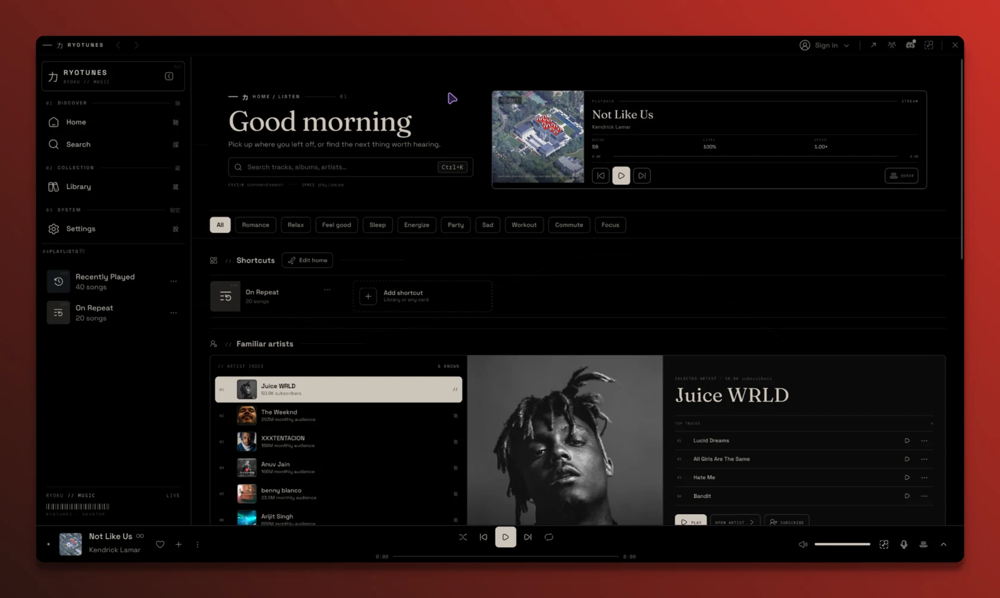

# Ryotunes

A Ryoku-native music player with native libmpv playback, live desktop colours,
MPRIS media controls, a compact mini-player, search, playlists, and a music library.

## Install

Install **Ryotunes** from this bundle in RyoStore. The bundle uses the current
`ryotunes` package from Ryoku's package repository, through the normal package
manager and its authorization prompt. It does not download or execute an
upstream installer, overwrite launchers itself, or activate a shell plugin.
If Ryotunes is already installed, the store reports it as present. Launch it with
`ryotunes`; normal package updates supply application updates.

Ryotunes is a standalone application, not an in-process shell plugin. The original
submission called it a plugin, but the current Ryoku integration is the packaged
application. Do not install the old `ryotunes-v2.4` replacement alongside it: the
current package replaces that legacy packaging.

The preview is the contributor's original submission capture; the packaged
application continues to evolve. Additional appearance options are in RyoStore's
**Ryotunes skins** catalogue.

## Origin and maintenance

Submitted by **ashmitvoid** in
[ryostore issue #5](https://github.com/ryoku-dev/ryostore/issues/5), based on
[ashmitvoid/ryotunes](https://github.com/ashmitvoid/ryotunes), a GPL-3.0-or-later
modified work derived from [LiMusic](https://github.com/SimoHypers/limusic).
Ryoku's current package follows [ryoku-dev/ryotunes](https://github.com/ryoku-dev/ryotunes).
The package owns its application files and dependencies; this bundle only lists
that package. Source and licensing are available from those repositories.

Community submissions are maintained by their contributors, not the Ryoku team.
Contributors must return to update their store entries when compatibility or
security requirements change. Users remain responsible for inspecting code,
updates, network behavior, and permission prompts. Ryostore's automated screening
is a defensive filter, not a complete security audit or a guarantee of safety.

The application accesses music and artwork services over the network and keeps
its preferences, library, and cache under its own application directories. Review
the current application's documentation before use. No credentials or application
binaries are shipped in this bundle.
