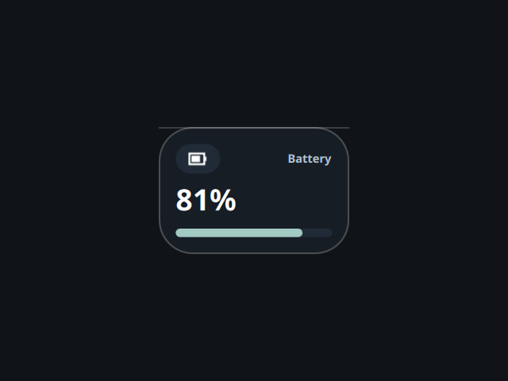

# Battery

A desktop tile showing battery charge and charging state, ported from the Awe
widget suite (github.com/neur0map/MJ-widgets, BSL-1.0).

## What it does

Every 3 seconds it reads `/sys/class/power_supply/BAT*/capacity` and `.../status`
(via `cat` and `head`) and draws the level as a big percentage, a progress bar,
and a hand-drawn vector badge that switches to a lightning bolt while charging.

## Commands and network

- Commands: `cat`, `head`.
- No network access.

It writes nothing to disk. The original stored tile position and scale on disk;
that persistence is dropped because the shell owns placement and scale.

## Credits

Ported from Awe by neur0map. BSL-1.0.
