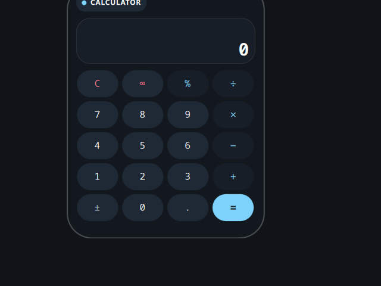

# Calculator

A desktop tile ported from the Awe widget suite
(github.com/neur0map/MJ-widgets, BSL-1.0).

## What it does

Material-style desktop calculator with a safe expression evaluator.

## Storage and commands

- Commands: `wl-copy` (tap the display to copy the result).
- Network: none.

It writes nothing to disk. The original stored tile position and scale in the desktop settings file; that persistence is dropped because the shell owns placement and scale.

Expressions are evaluated by a small built-in recursive-descent parser over `+ - * / ( )` and numbers, not JavaScript `eval`.

## Credits

Ported from Awe by neur0map. BSL-1.0.
