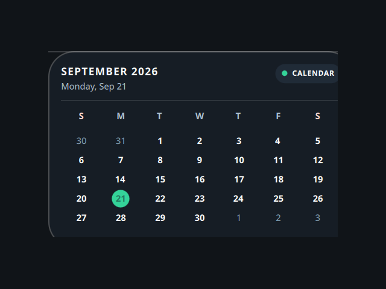

# Calendar

A desktop tile ported from the Awe widget suite
(github.com/neur0map/MJ-widgets, BSL-1.0).

## What it does

Compact monthly calendar that highlights today's date.

## Storage and commands

- Commands: none.
- Network: none.

It writes nothing to disk. The original stored tile position and scale in the desktop settings file; that persistence is dropped because the shell owns placement and scale.

## Credits

Ported from Awe by neur0map. BSL-1.0.
