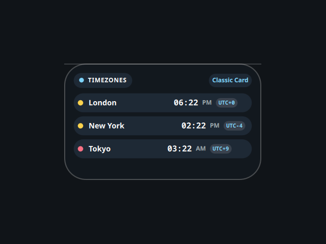

# World Clock

A desktop tile showing several time zones at once, ported from the Awe widget
suite (github.com/neur0map/MJ-widgets, BSL-1.0).

## What it does

Shows the current time for a list of cities, updated every second, in one of four
layouts: classic card, floating pills, grid tiles, and arch. Double-click the
tile to cycle the layout. Times are computed locally from UTC offsets, so there
is no network access, no external command, and nothing written to disk.

## Dropped feature (honesty)

The original opened a GTK3 dialog through `python3`/`PyGObject` to add custom
cities and persisted the list and layout to
`~/.config/quickshell/widget_settings.json`. That dialog is removed (it needs
`python3` + GTK, outside the plugin allowlist), so the city list is the three
built-ins (London, New York, Tokyo) and stays in-memory; the layout choice is
not persisted.

## Credits

Ported from Awe by neur0map. BSL-1.0.
