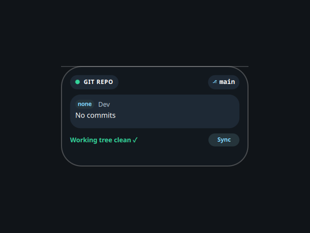

# Git Dashboard

A desktop tile summarising a git repository, ported from the Awe widget suite
(github.com/neur0map/MJ-widgets, BSL-1.0).

## What it does

Every 3 seconds it runs `git` inside `$HOME` and shows the current branch, the
number of uncommitted changes, and the last commit (short hash, author, subject).
The "Sync" button just refreshes the readout. It only ever runs
`git rev-parse`, `git status --porcelain`, and `git log -1` — all read-only and
local, no fetch or push, so no network access.

## Repository, commands, network

- Repository watched: `$HOME` (the original hardcoded another user's shell
  config path; that is replaced with `$HOME`). No plugin settings exist to change
  it. If `$HOME` is not a git repo it stays on idle defaults.
- Commands: `git`. Network: none. It writes nothing to disk.

## Credits

Ported from Awe by neur0map. BSL-1.0.
