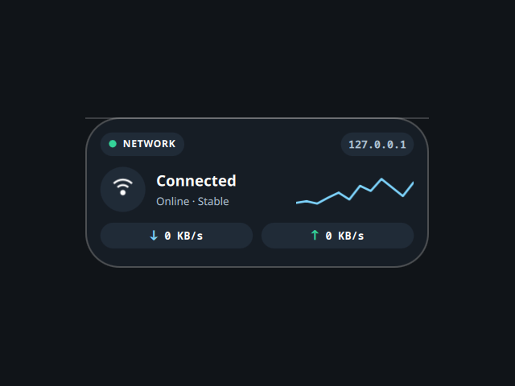

# Network

A desktop tile showing live network status, ported from the Awe widget suite
(github.com/neur0map/MJ-widgets, BSL-1.0).

## What it does

Every 2 seconds it reads the active Wi-Fi SSID with `nmcli`, finds the outbound
source IP with `ip route get 1.1.1.1` (a local routing-table lookup, no packet
is sent), and totals interface bytes from `/proc/net/dev` to compute down/up
throughput and draw an activity sparkline. Click the IP pill to blank it.

## Network and commands

- Hosts referenced: `1.1.1.1` (route lookup only, no connection).
- Commands: `nmcli`, `ip`.

It writes nothing to disk. The original persisted tile position, scale, and the
IP-hidden flag in `~/.config/quickshell/widget_settings.json`; that is dropped
here because the shell owns placement, and the IP-hidden toggle is in-memory.

## Credits

Ported from Awe by neur0map. BSL-1.0.
