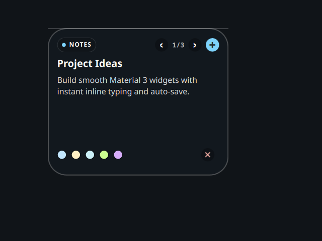

# Notes

A desktop tile ported from the Awe widget suite
(github.com/neur0map/MJ-widgets, BSL-1.0).

## What it does

Inline-editable sticky notes with colour tags, saved locally between sessions.

## Storage and commands

- Commands: `mkdir` (creates the state directory on first save).
- Network: none.

State lives in `$XDG_STATE_HOME/ryoku/plugins/awe-notes/state.json` (one JSON document, created with `mkdir -p` on first save). Tile position and scale are not stored here; the shell owns placement and sizing.

## Credits

Ported from Awe by neur0map. BSL-1.0.
