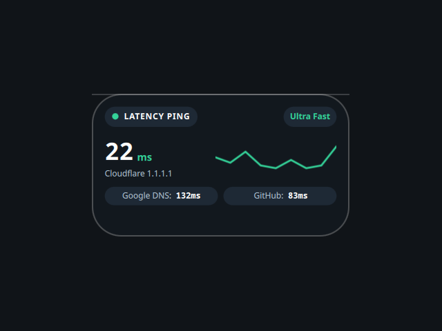

# Ping

A desktop tile that tracks network latency, ported from the Awe widget suite
(github.com/neur0map/MJ-widgets, BSL-1.0).

## What it does

Every 3.5 seconds it runs `ping -c 1 -W 1` against `1.1.1.1` (Cloudflare) and
`8.8.8.8` (Google DNS), parses the round-trip time with `awk`, and draws the
Cloudflare figure as a jitter sparkline with a quality tag (Ultra Fast / Good /
High Latency). The "GitHub" row is a derived estimate from those two samples, not
a separate request.

## Network and commands

- Hosts contacted: `1.1.1.1`, `8.8.8.8` (ICMP echo).
- Commands: `ping`, `awk`.

It writes nothing to disk. The original stored tile position and scale in
`~/.config/quickshell/widget_settings.json`; that persistence is dropped here
because the shell owns placement and scale.

## Credits

Ported from Awe by neur0map. BSL-1.0.
