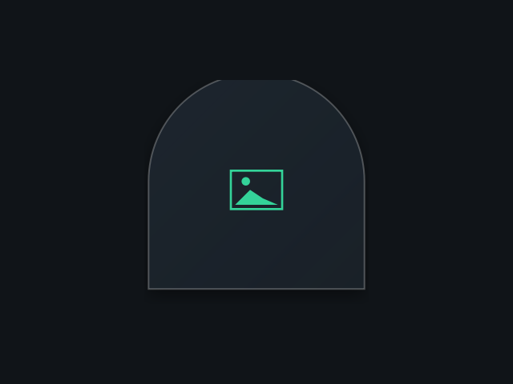

# Poster

A decorative image frame, ported from the Awe widget suite
(github.com/neur0map/MJ-widgets, BSL-1.0).

## What it does

Masks a still image or animated GIF into one of ten Material organic shapes
(squircle, arch, scallop, flower, pebble, heart, and more) with a soft shadow
and a themed outline. Double-click to cycle the shape.

## Dropped feature (honesty)

The original opened a GTK3 file chooser through `python3`/`PyGObject` to pick the
image, and persisted the chosen path and shape to
`~/.config/quickshell/widget_settings.json`. Both are removed here: the file
picker is dropped (it needs `python3` + GTK, outside the plugin allowlist), and
no image is bundled, so the widget renders its built-in Material placeholder.
The shape cycles at runtime but is not persisted. No commands, no network, no
disk writes.

## Credits

Ported from Awe by neur0map. BSL-1.0.
