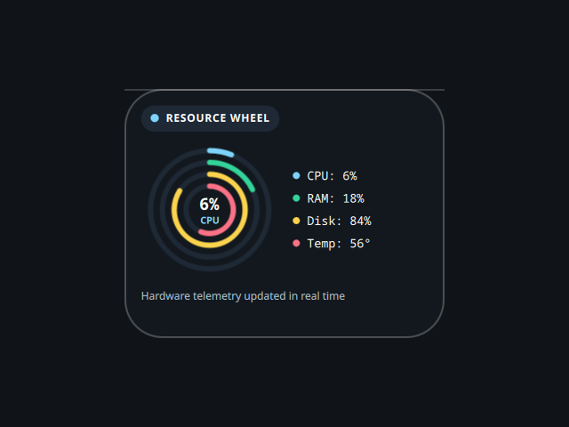

# Resource Wheel

A desktop tile with a concentric usage gauge, ported from the Awe widget suite
(github.com/neur0map/MJ-widgets, BSL-1.0).

## What it does

Every 2.5 seconds it samples four metrics: CPU from `/proc/stat` (`grep` + `awk`),
memory from `free` (`awk`), disk from `df /` (`awk`), and temperature from
`/sys/class/thermal/thermal_zone0/temp` (`cat` + `awk`). They render as four
nested progress arcs with a live CPU/RAM/Disk/Temp legend.

## Commands and network

- Commands: `grep`, `awk`, `free`, `df`, `cat`.
- No network access.

It writes nothing to disk. The original stored tile position and scale on disk;
that persistence is dropped because the shell owns placement and scale.

## Credits

Ported from Awe by neur0map. BSL-1.0.
