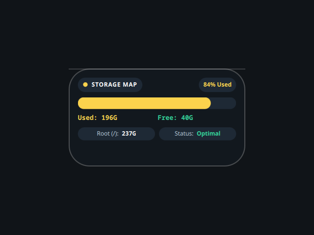

# Storage Map

A desktop tile showing root filesystem usage, ported from the Awe widget suite
(github.com/neur0map/MJ-widgets, BSL-1.0).

## What it does

Every 10 seconds it runs `df -h /`, piped through `awk` and `tr`, to read the
total, used and free size of the root filesystem. It renders a segmented usage
bar, a used-percent tag, and a used/free breakdown with the partition label.

## Commands and network

- Commands: `df`, `awk`, `tr`.
- No network access.

It writes nothing to disk. The original stored tile position and scale on disk;
that persistence is dropped because the shell owns placement and scale.

## Credits

Ported from Awe by neur0map. BSL-1.0.
