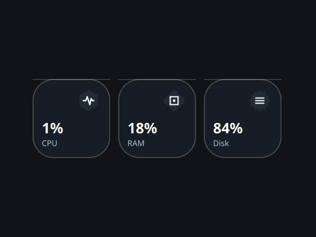

# System Info

A desktop tile showing CPU, RAM and disk usage, ported from the Awe widget
suite (github.com/neur0map/MJ-widgets, BSL-1.0).

## What it does

Every 2 seconds it reads `/proc/stat` and `/proc/meminfo` (via `cat`) to compute
CPU and memory load, and runs `df -k /` piped through `tail` and `awk` for disk
usage. The three figures render as frosted tiles with hand-drawn vector badges.
Double-click the widget to switch between the horizontal and vertical layouts.

## Commands and network

- Commands: `cat`, `df`, `tail`, `awk`.
- No network access.

It writes nothing to disk. The original stored tile position, scale and
orientation on disk; that persistence is dropped because the shell owns
placement and scale.

## Credits

Ported from Awe by neur0map. BSL-1.0.
