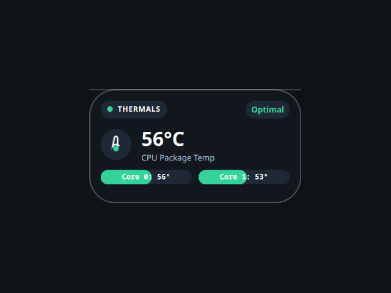

# Thermal

A desktop tile showing CPU temperature, ported from the Awe widget suite
(github.com/neur0map/MJ-widgets, BSL-1.0).

## What it does

Every 3 seconds it reads `/sys/class/thermal/thermal_zone0/temp` (via `cat` and
`awk`) and also tries `sensors` (lm_sensors), filtered with `grep` and `awk` and
cleaned with `tr`, preferring the sensors reading when present. It shows the CPU
package temperature, two per-core bars, and a status tag (Optimal / Warm / High).

## Commands and network

- Commands: `cat`, `awk`, `sensors`, `grep`, `tr`.
- No network access.

It writes nothing to disk. The original stored tile position and scale on disk;
that persistence is dropped because the shell owns placement and scale.

## Credits

Ported from Awe by neur0map. BSL-1.0.
