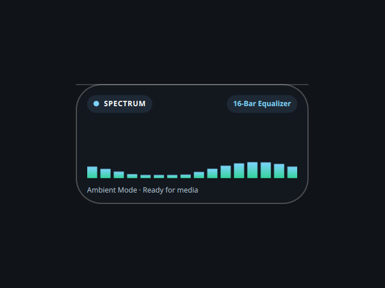

# Visualizer

A desktop audio-spectrum tile, ported from the Awe widget suite
(github.com/neur0map/MJ-widgets, BSL-1.0).

## What it does

Every 2 seconds it runs `playerctl status` to learn whether media is playing, and
animates a spectrum on a ~35 ms timer in one of three modes (bars, wave, radial);
double-click or tap the mode pill to cycle them. The bars are a simulated
spectrum driven by sine functions and the play/pause state, not a real FFT of the
audio, so it moves livelier while playing and idles gently when paused.

## Commands and network

- Commands: `playerctl`.
- No network access.

It writes nothing to disk. The original stored tile position, scale and mode on
disk; that persistence is dropped because the shell owns placement and scale.

## Credits

Ported from Awe by neur0map. BSL-1.0.
