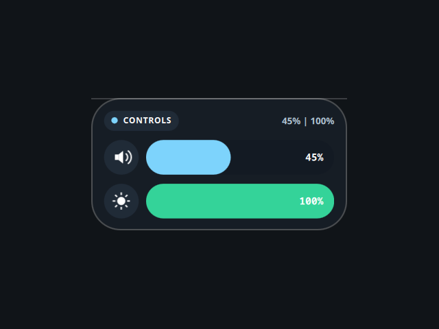

# Volume & Brightness

A desktop tile with quick audio and screen controls, ported from the Awe widget
suite (github.com/neur0map/MJ-widgets, BSL-1.0).

## What it does

Two sliders: drag or click the top one to set the default sink volume with
`wpctl set-volume`, tap the speaker to mute (`wpctl set-mute`); drag or click the
bottom one to set display brightness with `brightnessctl set`. Levels are polled
every 3 seconds with `wpctl get-volume` and `brightnessctl -m`.

## Commands and network

- Commands: `wpctl` (PipeWire/WirePlumber), `brightnessctl`.
- Network: none. It writes nothing to disk; the original stored tile position
  and scale in `~/.config/quickshell/widget_settings.json`, which is dropped
  because the shell owns placement.

## Credits

Ported from Awe by neur0map. BSL-1.0.
