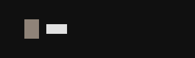

# Coffee

Keep the Ryoku desktop awake: a coffee-cup bar glyph that toggles the idle inhibitor, with a compact status panel.



## What it does

Coffee puts a small cup on the QS Bar. While it is lit, the desktop does not idle: no screen blank, no lock, no suspend. Tap the glyph for a panel that shows the state and how long it has been awake, and flip it from there — the panel is the only place that changes anything; a bar click never mutates.

Coffee drives the host desktop's **own caffeine bridge** (`~/.config/hypr/scripts/ryoku-cmd-caffeine`, the same script Ryoku's built-in Keep-Awake toggle runs). So the cup, the quick-settings tile and the deck toggle always agree, and a hold started here survives a shell reload exactly like the native one. Coffee never forks the truth: it reads state by polling `status`, applies the optimistic flip immediately, and confirms or corrects it on the next poll.

## Install

From a local checkout on a Ryoku desktop:

```
ryoku plugin add /path/to/coffee --bar --yes
```

or install it from **Ryostore → Plugins** once it is listed. Enable and place it under **Ryoku Settings → Plugins** (or **QS Bar Settings → Community** for the bar glyph).

## How it plugs in

- `service/Main.qml` is the headless state: it polls the caffeine bridge's `status` on a cadence (default 10 s), applies the optimistic state on toggle, and persists the start time in its `stateDir` so "Awake for" survives a reload.
- `content/Glyph.qml` is the bar mark (the PluginKit `coffee` glyph, accent-tinted while on); `content/Panel.qml` is the bar panel (state pill, awake-for, the one toggle button); `content/Card.qml` is the desktop tile.
- Settings are declared in the manifest and rendered by the shell; the plugin reads them through `pluginApi.pluginSettings` behind defaults.

## Settings

| Setting | Type | Default | What it does |
| --- | --- | --- | --- |
| Beside the mark (`barLabel`) | choice | `none` | Show nothing or the `ON`/`OFF` state beside the bar cup. |
| Refresh seconds (`poll`) | int | `10` | How often the service re-reads the inhibitor state (3–60). |
| Inhibitor script (`helperPath`) | text | *(host default)* | Override the caffeine bridge path on a system that lacks Ryoku's. |

## Runtime dependencies

- A running Ryoku shell (Quickshell) with `Ryoku.PluginKit`.
- The host caffeine bridge `ryoku-cmd-caffeine` (shipped by the desktop) — or set `helperPath` to an equivalent script.
- `timeout` and `systemd-inhibit` on `PATH` (declared in `dependencies.commands`).

No network access, no privileged actions.

## Develop

```
manifest.json        id, hosts, settings schema
service/Main.qml     state + logic (polls/toggles the caffeine bridge)
content/Glyph.qml    the bar mark
content/Panel.qml    the bar panel (the only mutating view)
content/Card.qml     the desktop tile
content/RowItem.qml  shared key/value row
content/Logic.js     pure helpers (argv, elapsed formatting) — unit-tested
tests/logic.test.cjs Node tests for Logic.js
```

Run the logic tests with plain Node (no QML runtime needed):

```
node tests/logic.test.cjs
```

## Credits

Inspired by [OmaPower](https://github.com/franck/omapower) for Omarchy. Built on the Ryoku plugin kit and the desktop's own caffeine bridge. MIT licensed.
