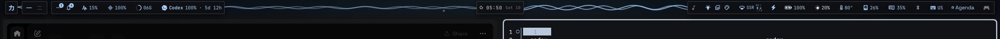

# Game Mode Optimizer

Temporarily stop voice typing and replace animated wallpapers while gaming, then restore your desktop.



## What it does

The QS Bar controller adds two desktop optimizations to **Quick Settings → Gaming** (Super+Esc): stop active Voxtype and switch live wallpapers to a static frame. Existing Gaming performance and DND behavior stays with Ryoku. The independent manual control and launcher wrapper apply only these two actions.

The previous wallpaper, audio settings and voice-typing state return after the last game/manual/Gaming hold ends. Already-off voice typing stays off. A static wallpaper stays unchanged. A wallpaper chosen during gaming is respected, as is a changed Voxtype service enablement setting. Overlapping games have independent holds; a killed wrapper retains its hold while its game process group survives.

One tested NVIDIA desktop reclaimed 1825 MiB of GPU memory with these actions. Savings vary by wallpaper, voice model and hardware; this is game-mode optimization, not a graphics-driver fix.

## Install

Install **Game Mode Optimizer** from Ryostore → Plugins, or install a reviewed local copy with `ryoku plugin add <folder> --bar --yes`. Click the controller icon on the QS Bar for its panel. Preferences are also under **QS Bar Settings → Community**.

Requires Python 3, systemd user services and Ryogami. FFmpeg is needed to extract a still frame from video; selecting an existing static image avoids extraction. Voxtype is optional: an absent or inactive service is left alone. No root access or separate service installation is required. The first client starts a helper; the bar monitors it. If the widget is unloaded and no game remains, the helper restores the desktop and exits after 15 seconds without requests. Existing service-managed deployments may still run `bin/game-memory daemon` directly.

### Automatic game launches

Use the installed `bin/game-memory-run` as a launcher wrapper. Launcher settings are configured by you; this plugin never edits Heroic or Steam configuration.

**Heroic:** Settings → Advanced → Wrapper (the exact section can vary by version). Add the executable at `~/.local/share/ryoku/plugins/game-memory-mode/bin/game-memory-run`, using your full home-directory path. Leave wrapper arguments empty. Configure Game Defaults for new games, and existing games individually if they override defaults. Preserve any other wrappers already in use.

**Steam:** Game → Properties → General → Launch Options. With the default XDG data location:

```sh
"$HOME/.local/share/ryoku/plugins/game-memory-mode/bin/game-memory-run" %command%
```

Prefix existing launch options instead of replacing them. Steam requires this once per game; it has no universal per-game launch-option default. If you use a custom XDG data home, use the actual installed path.

The wrapper waits for desktop preparation before starting the game. Turning off **Automatic on game launch** makes the wrapper run the game without acquiring a hold. Launch failure releases its own hold. Shell reloads do not interrupt an existing game hold.

### Remove

Close wrapped games, turn Gaming/manual mode off, and remove the wrapper from launcher settings before removing the plugin through QS Bar Settings or Ryostore. The ordinary helper restores and exits when the widget stops polling. To stop it immediately, run the installed `bin/game-memory shutdown`. For a pre-existing systemd-managed deployment, stop and disable your own helper unit first. Runtime state is kept in the plugin's own directory; the plugin does not delete it automatically.

## How it plugs in

- `service/Main.qml` polls the local helper and passes declared settings. The bar glyph only opens the panel; actions occur in the panel or follow the user's Gaming/launcher configuration.
- `bin/game-memory` runs an unprivileged Python helper and CLI. It executes `systemctl --user` for Voxtype and `ffmpeg` for a still frame. Games are passed as argv arrays to `bin/game-memory-run`; no shell strings are generated.
- Reads: published Ryoku `flags.json` Gaming state, the user's `/proc` process identities/groups, boot identity, Voxtype service status/enablement, selected wallpaper/image files, and Ryogami's local JSON-RPC socket.
- Writes: only `$XDG_STATE_HOME/ryoku/plugins/game-memory-mode` (private state, preferences, snapshots, still frames and controller socket). Restores wallpapers through the owning Ryogami API. Stops/starts only `voxtype.service`; never changes its enablement. No launcher configuration, shell stores, login scripts, user units or shipped Ryoku files are edited.
- No network access, downloads, privileged operations, NVIDIA dependency or compositor-specific API. Source code runs with the user's permissions and is not sandboxed by the store.

Limitations: active wallpaper auto-rotation refuses activation; turn rotation off first. Video/static wallpapers work automatically; Wallpaper Engine needs a static image path. Failed preparation blocks a wrapped launch and reports an error. GPU memory cannot be released by merely pausing a video or suspending the voice process, so these are stopped/replaced. A game that changes its process group independently of its launcher may escape group tracking; automatic holds are intended for launchers that preserve the game process group.

## Settings

| Setting | Default | Effect |
| --- | --- | --- |
| Automatic on game launch | On | Wrapped launches acquire a game hold. |
| Follow the Gaming toggle | On | Existing Quick Settings Gaming adds these two actions. |
| Static image path | Blank | Use a frame of the video; supply an absolute image path for other live wallpaper types. |

## Develop

```text
manifest.json
service/Main.qml
content/Widget.qml
content/Panel.qml
bin/game-memory
bin/game-memory-run
bin/test-controller
bin/test-startup
bin/test-live
assets/preview-widget.png
```

Run `PYTHONDONTWRITEBYTECODE=1 bin/test-controller`, `bin/test-startup`, and `ryoku plugin validate .`. The startup test uses isolated temporary state and does not change your desktop. `bin/test-live` is an explicit live qualification: it temporarily changes wallpaper/voice state, launches short sleep processes, kills this helper to check recovery, and verifies restoration. Run it only with no active Gaming/manual/game hold and after reviewing it. It is never an install hook. Live tests require the wrapper/helper paths to be from the same installation.

## Credits

MIT © 2026 Sannidhya Sandheer. Built with Ryoku PluginKit and Ryogami. Community maintenance belongs to the contributor, not the Ryoku team. Reports and maintenance contact: [@sannidhyas](https://github.com/sannidhyas), through the [Ryostore issue tracker](https://github.com/Ryoku-dev/ryostore/issues). Store screening is not a security guarantee; review source and updates before enabling.
