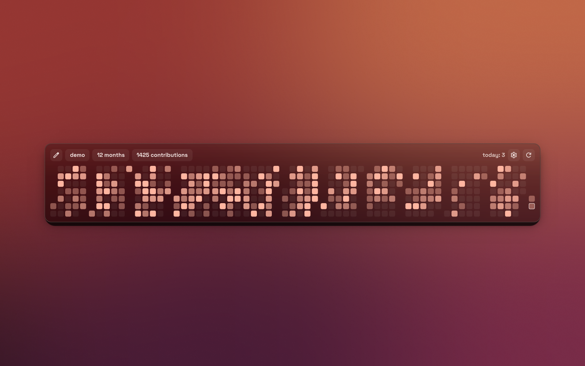
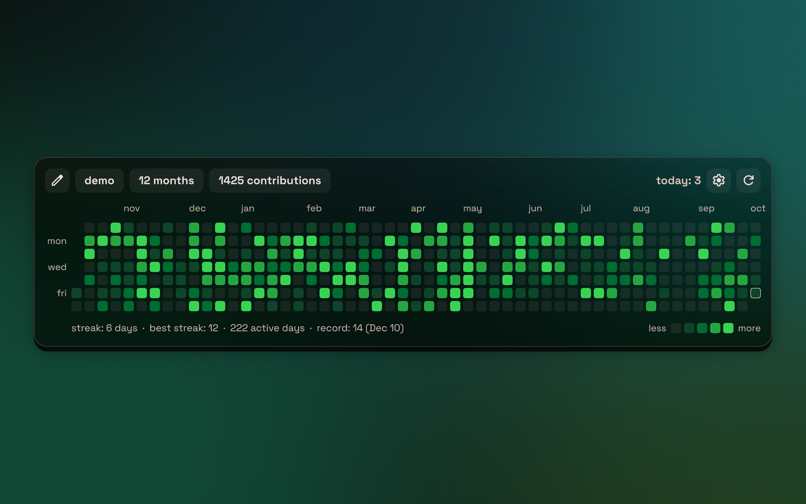
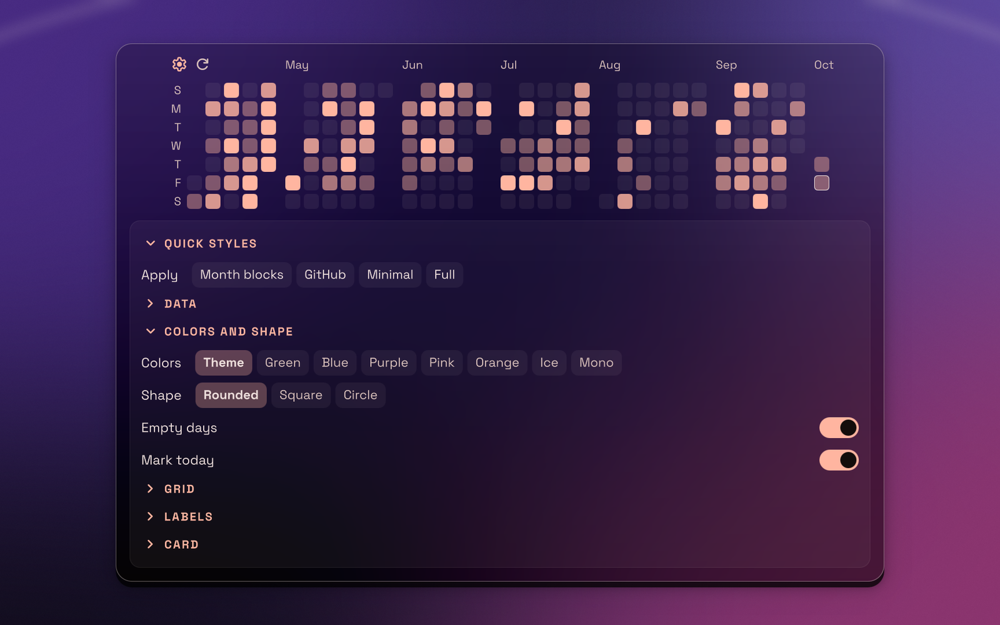
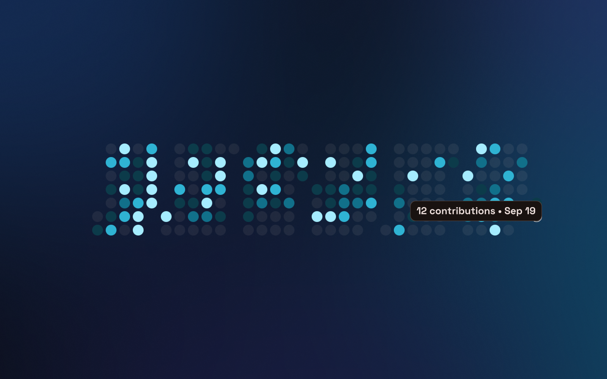

# GitHub Heatmap

Your GitHub contribution calendar, living on the wallpaper. One square per day,
coloured by how much you shipped, with streaks, records and a hover readout,
all styled to sit next to Ryoku's own desktop widgets.

## Features

- **Your calendar, no token.** Reads the public contributions page; with the
  GitHub CLI logged in, it picks up your username on its own.
- **Year or last N months.** Step through past years, or show the last 1–12
  months ending today.
- **Quick styles.** One click for *Month blocks*, *GitHub*, *Minimal* or *Full*,
  then fine-tune anything.
- **Eight palettes.** Theme (follows your wallpaper accent), Green, Blue,
  Purple, Pink, Orange, Ice and Mono, with GitHub's levels or a scale relative
  to your best day.
- **Shape and spacing.** Rounded, square or circle cells; cell size and gap;
  months as one continuous grid or as separate blocks.
- **Labels your way.** Month names (`jan`, `Jan`, `J`, `1`), weekday labels
  (`mon wed fri`, all, or initials), week starting Sunday or Monday, text size.
- **Streaks and record.** Current and best streak, active days and your
  biggest day, plus a legend.
- **Hover info** as a floating tip, in the toolbar, or off; optional click to
  open that day on GitHub.
- **Card options.** Toolbar on or off, frosted glass or solid background,
  opacity, corners and border.
- **English and Spanish**, following the system language by default.

## Settings

Hover the widget and press the gear: a panel opens under the grid with the
options grouped in folding sections (Quick styles, Data, Colors and shape,
Grid, Labels, Card). The same options are in the desktop's right-click menu.
With the toolbar hidden, the gear and refresh icons appear in the top-left
corner on hover.

## Language

English and Spanish. The `language` setting defaults to `auto`, which follows
the system locale (`LANG`); any language other than Spanish shows English. The
right-click menu labels come from the manifest and stay in English.

## Glass background

The *Glass* background draws the same frosted wallpaper plate as Ryoku's
calendar. It needs the desktop host to hand plugins its wallpaper mirror
(`pluginApi.wallpaperSource` and `wallpaperRect`); on a host without them the
widget falls back to the solid card on its own.

## What it runs, reads and writes

- **Runs** `bin/gh-contrib <username> <year|last>` (Python 3, stdlib only) on
  load, on refresh, on a period change, and every `refreshMin` minutes
  (default 30).
- **Network**: `github.com` only, the public page
  `https://github.com/users/<user>/contributions` (with `from`/`to` for a
  calendar year). No token, no login; it sees public contributions, and private
  ones only if the user enabled "Private contributions" on their profile.
- **Runs** `gh api user --jq .login` (GitHub CLI) once when no username is
  set, to take the logged-in account as the default. Optional.
- **Opens** `https://github.com/<user>?tab=overview&from=<day>&to=<day>` in the
  browser only when "Click opens the day on GitHub" is on and a day is clicked.
- **Writes**: nothing but its own settings, through `pluginApi.saveSetting` on
  the bar or `ryoku-plugins-place github-heatmap settings <json>` on the
  desktop (the shell's own settings writer; the desktop host has no
  saveSetting).
- No privileged actions.

Preview images use generated demo data and backgrounds.
