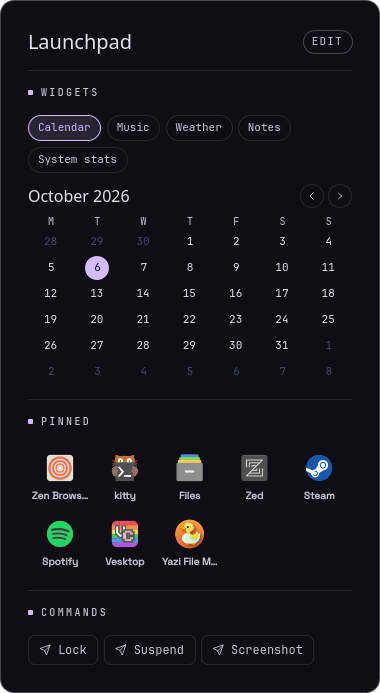
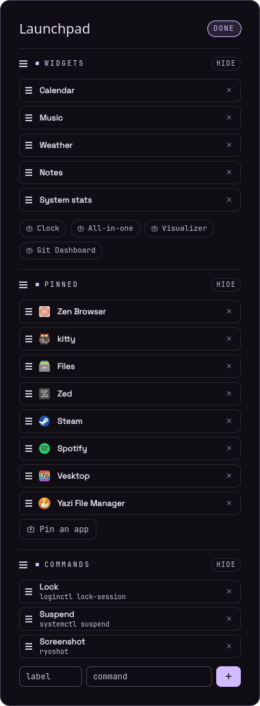

# Launchpad

A Ryoku bar plugin (`launchpad`): one tile mark on the QS Bar that opens a
pinboard panel.

 

- **Widgets**: the widgets you pick, as tabs: **Clock, Calendar, Music** (any
  MPRIS player), **All-in-one** (clock + weather + visualizer), **System stats**
  (CPU, memory, swap, load, uptime), **Weather** (now + 5 days), **Notes** and
  **Visualizer** (a cava spectrum), plus every desktop-widget plugin you have
  installed from Ryostore, mounted in the panel the way the desktop mounts it.
- **Pinned apps**: your favourite apps as a grid; click to launch.
- **Commands**: one-click chips that run a command.

Click **EDIT** to change any of it:

- every section (Widgets, Pinned, Commands) gets a grip to **drag** it into place
  and a **HIDE / SHOW** pill;
- widgets, pinned apps and commands turn into lists: **drag** a row by its grip
  to reorder, **×** to remove;
- **Pin an app** opens a search, the widget list offers every widget not yet
  picked, and a label + command row adds a command.

Everything is also in QS Bar Settings > Community > Launchpad.

## What it runs, reads and writes

  commands, exactly as you typed them, in your terminal (`ryoku-app terminal --`), as an argv split on spaces (quotes group
  commands, exactly as you typed them, as an argv split on spaces (quotes group
  words). There is **no shell**, so pipes, `&&` and `$VARS` do nothing; point a
  command at a script on your `PATH` if you need them. It also runs
  `ryoku-shell icons` once (the icon index), and `cava -p <stateDir>/cava.conf`
  only while the Visualizer or All-in-one tab is on screen.
- **Reads**: the installed desktop entries, `ryoku plugin list --json` (to find
  desktop-widget plugins; their own code then runs inside the panel), the MPRIS
  players on the session bus, the shell daemon's `weather` feed over its local
  socket (`$XDG_RUNTIME_DIR/ryoku-shell.sock`; Ryoku does the fetch, so set
  your location and units in Ryoku Hub), `/proc/loadavg`, `/proc/uptime`, `/proc/stat` and `/proc/meminfo`
  (every 2 s, only while the panel is open).
- **Writes**: its own settings, through the bar (`pluginApi.saveSetting`), and
  your notes and the cava config to `$XDG_STATE_HOME/ryoku/plugins/launchpad/`. A hosted
  desktop-widget plugin writes only to its own state folder, as it does on the desktop.
- **Network**: none. **Privileged**: none.

## Settings

QS Bar Settings > Community > Launchpad.

| key          | type   | default                                                  | description                               |
| ------------ | ------ | -------------------------------------------------------- | ----------------------------------------- |
| showWidgets  | toggle | true                                                     | Show the Widgets section                  |
| showPinned   | toggle | true                                                     | Show the Pinned section                   |
| showCommands | toggle | true                                                     | Show the Commands section                 |
| sectionOrder | text   | `widgets pinned commands`                                | Section order                             |
| widgetList   | text   | `calendar music notes`                                   | Widget tabs in order: `clock calendar music aio stats weather notes visualizer`, `plugin:<id>` for a store widget |
| apps         | text   | (empty)                                                  | Pinned desktop ids, space-separated       |
| columns      | int    | 5                                                        | App grid columns (3–8)                    |
| commands     | text   | `Lock=loginctl lock-session ; Suspend=systemctl suspend` | `Label=command` pairs split by ` ; `      |

## Install

```
ryoku plugin validate .
ryoku plugin add . --bar --yes
```

## Author

guyb <blumguy111@gmail.com>. Community-made (`official` is false). MIT licence.
